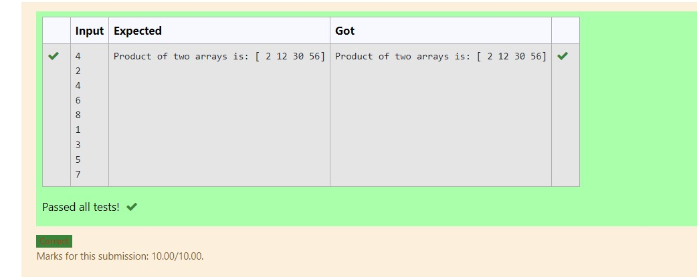

# Multiplying-two-matrix

## AIM:
To write the python program for Multiplying two matrices.

## ALGORITHM:

### Step 1:
Start the python program.
### Step 2:
Import numpy.create two null lists.
### Step 3:
Get two matrices from the user using append.
### Step 4:
Multiply the two matrices.
### Step 5:
Display the result.

## PROGRAM:
Develped by : MANOJ KUMAR.S

Reg.No: 21500146
 
```
import numpy as np
m=int(input())
l1,l2=[],[]
for i in range(m):
    l1.append(int(input()))
for i in range(m):
    l2.append(int(input()))
A1=np.array(l1)
A2=np.array(l2)
result=A1*A2
print("Product of two arrays is:",result)
```

## OUTPUT:


## RESULT:
Thus the multiplication of matrix is done.
